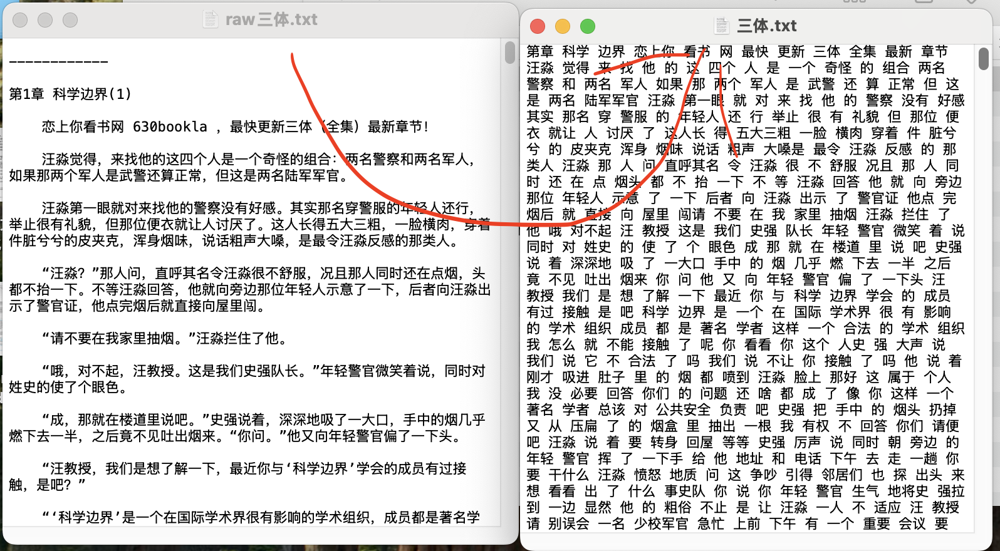
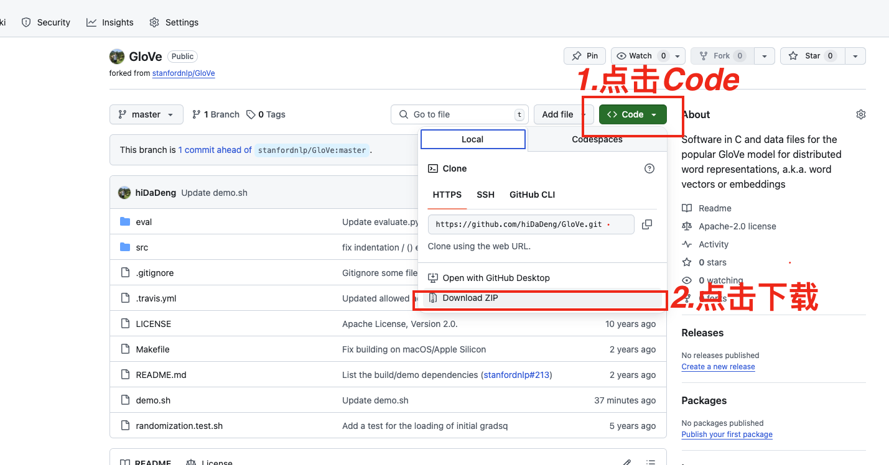
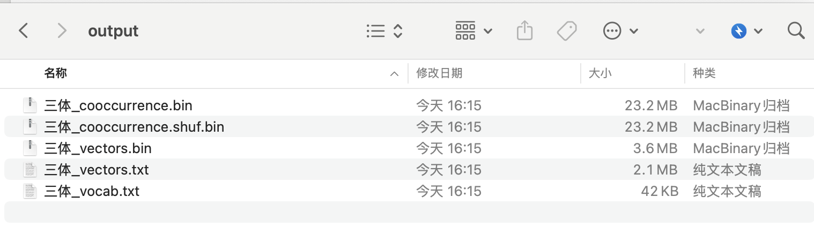
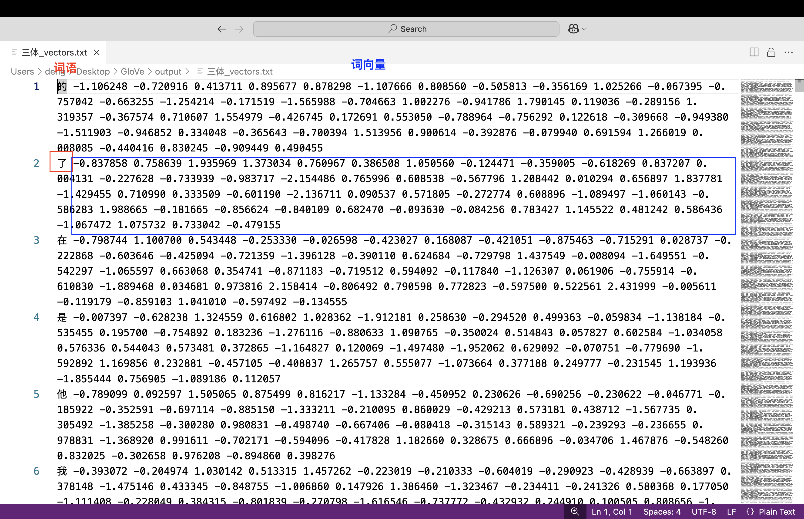
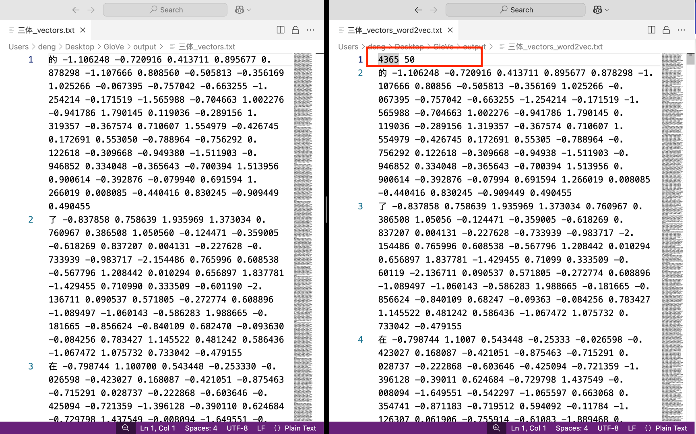

## 一、简介

[Stanford GloVe](https://nlp.stanford.edu/projects/glove/)（Global Vectors for Word Representation）算法作为一种融合全局统计信息与局部上下文窗口的词嵌入模型，相较于Word2Vec仅依赖局部上下文，GloVe利用全局统计信息，能更精准地反映词频分布特征。例如，在高维词向量（如200D）中，GloVe在词语类比任务中准确率达75%，并在命名实体识别任务中优于其他词嵌入模型。因其高效的语义表征能力，在社会学、管理学等领域展现出广泛的应用价值。 相关词嵌入文献资料可阅读

- [https://textdata.cn/blog/2023-11-03-organization-science-with-word-embeddings/](https://textdata.cn/blog/2023-11-03-organization-science-with-word-embeddings/)
- [转载|大数据时代下社会科学研究方法的拓展——基于词嵌入技术的文本分析的应用](https://textdata.cn/blog/2022-04-07-word-embeddings-in-social-science/)
- [词嵌入技术在社会科学领域进行数据挖掘常见39个FAQ汇总](https://textdata.cn/blog/2023-03-15-39faq-about-word-embeddings-for-social-science/)
- [文献汇总 | 词嵌入 与 社会科学中的偏见(态度)](https://textdata.cn/blog/2022-04-09-literature-about-embeddings/)
- [词嵌入测量不同群体对某概念的态度(偏见)](https://textdata.cn/blog/2022-04-01-embeddings-and-attitude/)

<br><br>

## 二、环境准备
### 2.1 Windows
1. 打开 ***cmd***（建议以管理员身份运行）。

2. 运行以下命令来安装 ***Chocolatey***：

   ```
   Set-ExecutionPolicy Bypass -Scope Process -Force; [System.Net.ServicePointManager]::SecurityProtocol = [System.Net.SecurityProtocolType]::Tls12; iex ((New-Object System.Net.WebClient).DownloadString('https://community.chocolatey.org/install.ps1'))
   ```

3. 安装完成后，重新打开一个新的 ***cmd*** 窗口。 运行以下命令确认 ***Chocolatey*** 是否成功安装：

   ```
   choco --version
   ```

4. 安装 ***make***

   ```
   choco install make
   ```

5. 安装完成后，重新打开一个新的 ***cmd*** 窗口。 运行以下命令确认 ***make*** 是否成功安装：

   ```
   make --version
   ```

6. 获取[cntext2.x](https://textdata.cn/blog/2024-04-27-cntext2x-usage-tutorial/) 的安装文件 ***cntext-2.1.4-py3-none-any.whl***，并将该whl文件放置于桌面。执行以下安装命令

   ```
   cd Desktop
   pip install cntext-2.1.4-py3-none-any.whl
   ```

<br>


### 2.2 Mac
1. 打开 ***terminal***，执行命令

    ```
    /bin/bash -c "$(curl -fsSL https://raw.githubusercontent.com/Homebrew/install/HEAD/install.sh)"
    ```

2. 安装完成后，重新打开一个新的 ***terminal*** 窗口。 运行以下命令确认 ***Homebrew*** 是否成功安装：

    ```
    brew --version
    ```

3. 安装 ***make***

    ```
    brew install make
    ```

4. 安装完成后，重新打开一个新的 ***terminal*** 窗口。 运行以下命令确认 ***make*** 是否成功安装：

    ```
    make --version
    ```

5. 获取[cntext2.x](https://textdata.cn/blog/2024-04-27-cntext2x-usage-tutorial/) 的安装文件 ***cntext-2.1.4-py3-none-any.whl***，并将该whl文件放置于桌面。执行以下安装命令

   ```
   cd desktop
   pip3 install cntext-2.1.4-py3-none-any.whl
   ```

<br><br>

## 三、训练中文GloVe

### 3.1 准备中文语料

以三体小说为例，



<br>

```python
import re
import jieba

# 读取原始数据「raw三体.txt」
raw_text = open('raw三体.txt').read()

# 去除非中文字符
chinese_text = ''.join(re.findall(r'[\u4e00-\u9fa5]+', raw_text))

# 分词并保存到「三体.txt」中
with open('三体.txt', 'a+', encoding='utf-8') as f:
    f.write(' '.join(jieba.lcut(text)))
```

<br>


### 3.2 下载GloVe

这里大邓准备了两个选择

```
- stanfordnlp/GloVe            https://github.com/stanfordnlp/GloVe  
- hiDaDeng/GloVe               https://github.com/hiDaDeng/GloVe
```

[***stanfordnlp/GloVe***](https://github.com/stanfordnlp/GloVe)设计很巧妙， 但该项目没有展示环境配置、中文实验数据、中文实验结果。 

因此， 大邓在 [***stanfordnlp/GloVe***](https://github.com/stanfordnlp/GloVe) 基础上， 添加了增加了环境配置、代码参数说明、准备中文实验数据、中文实验结果等说明。

接下来以 [***hiDaDeng/GloVe***](https://github.com/hiDaDeng/GloVe) 做说明。



<br>

### 3.3 GloVe文件目录

从  [***hiDaDeng/GloVe***](https://github.com/hiDaDeng/GloVe) 解压后得到 ***GloVe-master*** 文件夹。 ***GloVe-master*** 目录(含义)


```
GloVe
├── README.md  GloVe代码说明文档
├── src        GloVe算法C语言源代码
├── eval       评估代码
├── demo.sh    GloVe训练命令(这里是重点)
├── output     GloVe训练输出文件夹；此处存储着大邓使用{三体.txt}训练出的Glove模型相关文件
│   ├── 三体_cooccurrence.bin
│   └── 三体_cooccurrence.shuf.bin
│   └── 三体_vectors.txt
│   └── 三体_vectors.bin 三体_vocab.txt
│   └── 三体_vocab.txt
```

<br>

这里我们展示下 ***demo.sh***的源代码， 并对部分代码进行展示说明。

```bash
# 设置语料数据文件
# 注意: 中文语料文件必须是分词后的文本文件。
# 如 「我是中国人，我爱中国」 要整备成 「我 是 中国人 ， 我 爱 中国」
CORPUS_FILE = 三体.txt

# 创建 output 文件夹，保存训练结果(模型文件bin/txt等文件)
OUTPUT_DIR = "output"

# 程序运行时允许使用的最大内存，单位为 GB
# 注意: 此值越大，程序运行速度可能越快，但也会占用更多系统资源
MEMORY = 4.0

# 词汇表中单词的最小出现次数
# 出现次数低于此值的单词将被忽略，以减少词汇表的大小
# 注意: 此值越大，模型可能越精确，但词汇表也会越小
VOCAB_MIN_COUNT = 5

# 每个单词向量的维度大小
# 维度越大，向量表示的信息越丰富，但计算成本也越高
VECTOR_SIZE = 50   

# 训练模型的最大迭代次数
# 迭代次数越多，模型可能越精确，但训练时间也会相应增加
MAX_ITER = 15

# 计算共现矩阵时考虑的上下文窗口大小
# 即当前单词前后各多少个单词会被考虑在内
WINDOW_SIZE = 15   

# 训练模型时使用的线程数量
# 线程数越多，训练速度可能越快，但也会占用更多系统资源
NUM_THREADS = 8

# 共现矩阵中元素的最大计数值； 超过此值的元素将被截断为该值
X_MAX = 10 
```


<br>

### 3.4 开始训练

以准备好的 ***三体.txt*** 语料文件为例， 训练 50 维的 GloVe 模型(VECTOR_SIZE=50)， 结果保存到  ***output*** 文件夹内。

<br>

1. 打开 ***cmd*** (Mac用户打开terminal) 。

2. 将 ***GloVe-master*** 文件夹移动到桌面。 在 ***cmd*** 执行以下命令，切换工作目录到 ***GloVe-master*** 文件夹。

   ```
   cd desktop/GloVe-master
   ```

3. 在 ***cmd*** 中执行

   ```
   ./demo.sh
   ```

大概运行了几分钟就出结果了。 



<br>

### 3.5 转化成Word2Vec格式

打开 ***三体_vectors.txt*** 查看不同词语对应的词向量




注意刚刚生成的 ***output/三体_vectors.txt*** 是无法用 python 直接利用的。 

使用 gensim库 或 cntext2.x 库将其转化为 word2vec 格式的txt文件。


```python
import cntext as ct

glove_file = 'output/三体_vectors.txt'
word2vec_file = 'output/三体_vectors_word2vec.txt'

# 将Glove转化为Word2Vec格式
ct.glove2word2vec(glove_file, word2vec_file)
```




其实两个txt文件的区别，仅仅是在 ***三体_vectors_word2vec.txt*** 在第一行多了两个数字， 分别代表词汇表大小和向量维度。


<br>

## 四、使用中文GloVe模型
### 4.1 加载模型

```python
import cntext as ct

word2vec_file = 'output/三体_vectors_word2vec.txt'

# 加载word2vec模型.txt文件
wv_model = ct.load_wv(word2vec_file, binary=False)
wv_model
```
Run
```
<gensim.models.keyedvectors.KeyedVectors at 0x336ff8dd0>
```

<br>

### 4.2 KeyedVectors的操作方法(或属性)

| 方法 | 描述 |
| --- | --- |
|  `KeyedVectors.key_to_index` | 获取单词到索引的映射。 |
|  `KeyedVectors.vector_size` | 获取GloVe模型中任意词向量的维度。 |
|  `KeyedVectors.get_vector(word)` | 获取给定单词的词向量。 |
|  `KeyedVectors.index_to_key` | 获取词汇表中的所有单词。 |
|  `KeyedVectors.similar_by_word(word, topn=10)` | 获取某词语最相似的10个近义词。 |
|  `KeyedVectors.similar_by_vector(vector, topn=10)` | 获取词向量最相似的10个近义词。 |
|...|...|


### 4.2.1 词表

<br>

```python
wv_model.index_to_key
```
Run
```
['的',
 '了',
 '在',
...
 '引力',
 '所说',
 '星际',
 ...]

 ```
<br>


### 4.2.2 词表映射

```python
wv_model.key_to_index
```
Run
```
{'的': 0,
 '了': 1,
 '在': 2,
...
 '引力': 997,
 '所说': 998,
 '星际': 999,
 ...}
```

<br>

### 4.2.3 向量维度数

```python
print(f'词表有 {len(wv_model.key_to_index)} 个词')
print(f'向量是 {wv_model.vector_size} 维')
```

Run

```
词表有 4365 个词
向量是 50 维
```

<br>

### 4.2.4 获取词向量

```python
# 查看「降临」的词向量
wv.get_vector('降临')
```
Run
```
array([ 0.672314,  0.020081,  0.653733,  0.598732, -0.680517, -0.049689,
       -0.16845 , -0.06759 , -0.147955,  0.024006,  0.264551, -0.050127,
        0.252063, -0.475633,  0.103722, -0.012481,  0.040755,  1.154912,
        0.742695,  0.048619, -0.514424, -1.184054,  0.515892, -0.1034  ,
        0.368755, -0.690357, -0.784287, -0.505814,  0.035807, -0.166354,
       -0.26149 ,  0.015089,  0.10626 , -0.215666, -0.374001, -0.123558,
        0.422617, -0.075277, -0.316387, -0.484295,  0.059687,  0.132621,
        0.192094, -0.591919,  0.236281,  0.164198, -0.058724,  1.285457,
        0.905606, -0.52032 ], dtype=float32)
```


<br>


### 4.2.5 近义词

```python
wv.similar_by_word('三体', topn=10)
```
Run

```
[('叛军', 0.7699569463729858),
 ('更新', 0.7687217593193054),
 ('地球', 0.760529100894928),
 ('全集', 0.7575182914733887),
 ('最快', 0.7426372170448303),
 ('世界', 0.7262137532234192),
 ('最新', 0.7219281792640686),
 ('游戏', 0.7180070877075195),
 ('危机', 0.7020451426506042),
 ('教', 0.7012627720832825)]
```

<br>

### 4.2.6 计算多个词的中心向量

我们可以计算「三体」、「降临」、「组织」、「拯救」的中心向量eto_vector。 并试图寻找中心向量eto_vector的最相似的10个词。

```python
eto_vector = ct.semantic_centroid(wv=wv, words=['三体', '降临', '组织', '拯救'])

print(eto_vector)
# 寻找 eto_vector 语义最相似的10个词
wv.similar_by_vector(eto_vector, topn=10)
```
Run
```
[ 0.6267875   0.08975425  0.48438451  0.405128   -0.49928901  0.11347825
 -0.90057975  0.11877625 -0.27053049  0.344603    0.4368495  -0.3839495
  0.02633176 -0.138534    0.2531555  -0.0060905  -0.48776849  0.75548999
  0.72575876 -0.446079   -0.30361701 -1.039792    0.457687   -0.4286315
  0.44577325 -0.39119426 -0.4783935  -0.2596135  -0.32513325 -0.10315975
 -0.42880575 -0.48328425  0.129438   -0.17085625 -0.13454625 -0.070053
  0.68060375  0.16736924 -0.15664874 -0.20528575  0.385481    0.206432
  0.18913225 -0.93453825  0.58597099  0.60727924  0.009064    0.87661726
  0.65814423 -0.356567  ]

[('降临', 0.8707027435302734),
 ('组织', 0.8625670671463013),
 ('三体', 0.8621653914451599),
 ('派', 0.8343338966369629),
 ('拯救', 0.8301094174385071),
 ('叛军', 0.784512460231781),
 ('地球', 0.7536635398864746),
 ('世界', 0.7245718836784363),
 ('外部', 0.7078365087509155),
 ('入侵', 0.6962169408798218)]
```

<br>

熟悉三体的朋友应该能联想到背叛人类的ETO(地球三体组织)有两个派别，分别是拯救派和降临派。 

ETO开发了一款虚拟现实游戏，它向参与者展示了三体世界的真实情况，包括其恶劣的自然条件、三体文明的历史及其科技水平等。通过参与这个游戏，玩家们能够逐渐了解三体世界的真相，并最终决定是否要加入到支持三体文明入侵地球的行列中来。

这个游戏不仅充当了信息传递的媒介，也是甄别志同道合者的工具，让那些对人类社会现状不满、渴望变革的人们找到了组织，进而成为了背叛人类的叛军一员。在这个过程中，“三体游戏”起到了关键的作用，是连接地球人与三体世界的重要桥梁。

<br>